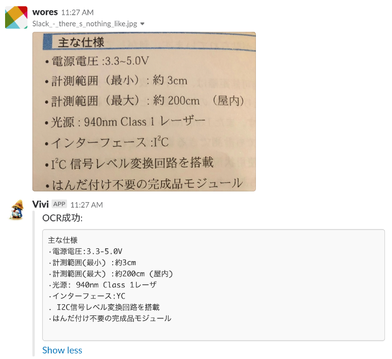

# Service
GAE/Goで動いているサービス
自分にとってあったら便利そうなものを追加していく

- Slackの特定のチャンネルに投稿された画像ファイル内のテキストをOCR(Cloud Vision API)で検出して投稿する。レイヤード風に実装してみた。



### 設定

gae以下に `secret.yaml` を作成して、下記コードを入力する
各トークンはよしなに入手しよう
```
env_variables:
  SLACK_TOKEN: 'xoxp-xxxx..............'
  VERIFICATION_TOKEN: '..........'
```
